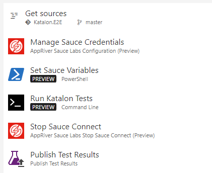

# Run Katalon Tests in Sauce Labs from TFS Build
Katalon Studio has the ability to execute tests in Sauce Labs, but there are some modifications that need to be made to fully integrate the test results between Sauce Labs and TFS.  Here are all of the steps to achieve a full integration.

* In Katalon Studio, configure the Remote execution for Sauce Labs.
  * Go to the Project menu > Settings > Execution > Default > Web UI > Remote
  * Set Remote web server url to 
  
    https://{your sauce username}:{your sauce token}@ondemand.saucelabs.com:443/wd/hub
  * Add at least 1 build capability, for example,
  
    browserName Chrome
    
    platform Windows10
* Save the project and push to source control
* In TFS, create a build that looks like this:

    

    The "Set Sauce Build Name" powershell step corresponds to the `saucelabs-integration.ps1` file in this repo.  

    This script sets the Sauce Labs "build" capability to the environment variable "SAUCE_BUILD_NAME".  This is required in order to fully integrate the Sauce Labs TFS extension.  In Katalon, the "build" capability is set in the project's *\settings\internal\com.kms.katalon.core.webui.remote.properties* file.  This file is a json file that contains the Sauce Labs connection info that was configured in the first step.  The script opens the file, converts it to a Json object, sets both the "build" and "name" capabilities, then saves the file.

* To run the Katalon test, make sure Katalon Studio is installed on the build agent.
* The "Run Katalon Tests" steps runs Katalon from the command line:

    `"C:\Program Files (x86)\Katalon\Katalon_Studio_Windows_64-5.6.3\katalon.exe"
-noSplash  -runMode=console -consoleLog -projectPath="%BUILD_SOURCESDIRECTORY%\E2E.prj" -retry=0 -testSuitePath="Test Suites/Smoke Suite" -executionProfile="default" -browserType="Remote"`
